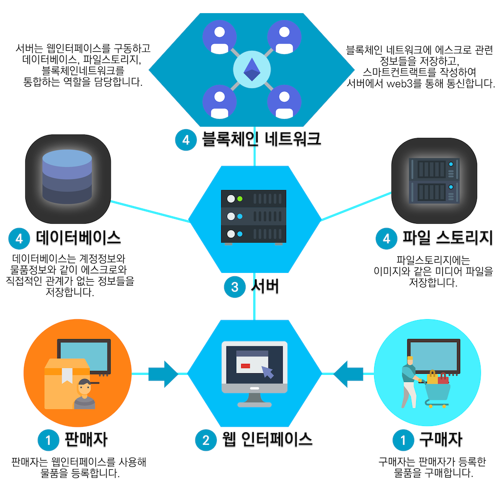

# 블록체인 중고거래 플랫폼 💎 ⛏️ 🔥

부산대학교 졸업과제로 진행하는 블록체인 중고거래 플랫폼입니다.


## Stack
- NodeJS
- MongoDB
- Go-ethereum
- Web3.js


## 1. 설정
### 1.1 필수 패키지 설치하기 (install packages)
```
npm i -g nodemon
npm i
```


### 1.2 .env파일 설정하기 (setup .env)
```.env.example``` 파일내용을 수정하고 ```.env``` 로 이름을 변경해줍니다.
```
# aws instance
DB_URI=mongodb://<HOST>:27017/<DATABASE NAME>
DB_USERNAME=<DATABASE USER NAME>
DB_PASS=<DATABASE USER PASSWORD>

# local computer
WEB3_PROVIDER=ws://<GETH WEBSOCKET PROVIDER HOST>:8546

# http port
PORT = 3333
```
```
cp .env.example .env
```

### 1.3 실행
```
npm run dev
```

### Geth(Go-Ethereum)
```
geth --datadir test-data init genesis.json
```

```
geth --rpc --ipcpath private-network/test-net/test.ipc --rpcaddr "0.0.0.0" --rpcvhosts "*" --rpccorsdomain "*" --rpcport "8545" --datadir private-network/test-data --networkid 1234 --allow-insecure-unlock --rpcapi web3,personal,eth,net,db,http --ws --wsaddr 0.0.0.0 --wsorigins '*' --wsapi web3,personal,eth,net,db,http --unlock '0,1,2,3'
```

```
geth attach private-network/test-net/test.ipc
geth account new --datadir private-network/test-data/
```

```
/Applications/Mist.app/Contents/MacOS/Mist --rpc private-network/test-net/test.ipc
```

## 2. SmartContract
스마트컨트랙트 코드는 ```./escrow.sol``` 에 위치해 있습니다.

## 3. 디렉토리 구조
```
.
project
│   .env.example
│   .gitignore
│   app.js 
│   escrow.sol 
│   package-lock.json 
│   package.json
│   README.md  
│
└───bin
│   │   www
│   
└───config
│   │   index.js
│   │   database.js
│ 
└───misc
│   │   system.png
│ 
└───models
│   │   index.js
│   │   BlockTransaction.js
│   │   Product.js
│   │   Transaction.js
│   │   User.js
│ 
└───public
│   │   css
│   │   fonts
│   │   images
│   │   img
│   │   js
│   │   uploads
│ 
└───routes
│   │   index.js
│   │   account.js
│   │   web3.js
│   │   api.js
│ 
└───views
│   │   login.ejs
│   │   signup.ejs
│   ...
│   ...
```

## 4. 전체 구성도


